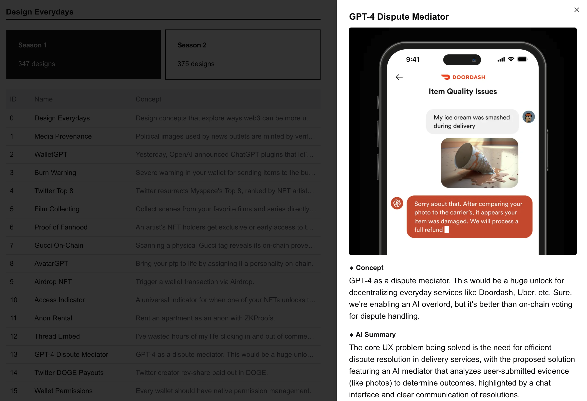

> [!NOTE]
> This repo was originally created for a [bounty](https://www.bountycaster.xyz/bounty/0x2ce371c71f9f33796b33034212aea5df9ca05da4) on Bountycaster.

# Design Everydays Visual Database



A simple app to review the [Design Everydays](https://designeverydays.com/) collections. Built with Bun, Next.js, Drizzle, and SQLite.

## Getting started

Copy the `.env.example` file to `.env.local` and update the `OPENAI_API_KEY`. You can create an API key in the [OpenAI dashboard](https://platform.openai.com/settings/organization/api-keys).

```bash
cp .env.example .env.local
```

The project comes with a snapshot of the Design Everyday collections.

- Season 1: tokens 0-346
- Season 2: tokens 0-374

The default database is a SQLite database that has already been seeded. Now you can just install the dependencies and run the app!

```bash
bun install
bun run dev
```

## Scripts

The project includes a snapshot of the Design Everyday tokens. You can retrieve new tokens by running the `fetch:tokens` script. This will create a new file in `src/server/scripts/output` with the new token data. To save the data to the database, run `db:add:tokens`.

```bash
bun run fetch:tokens
bun run db:add:tokens
```

If you want to clear the database of all collection and token data, run `db:reset`.

```bash
bun run db:reset
```

And you can reseed the database from the snapshot with the `db:seed` script.

```bash
bun run db:seed
```
